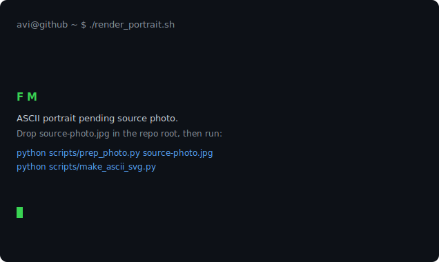

<h3><code>fez@github ~ $ ./contributions.sh</code></h3>

  

<h3><code>fez@github ~ $ whoami</code></h3>

<table>
  <tr>
    <td valign="top"></td>
    <td valign="top"></td>
  </tr>
</table>

<!--
  Everything above is self-contained animated SVG (GitHub strips <script> and
  inline CSS from READMEs, but renders SVGs embedded via  and runs their
  SMIL / CSS-keyframe animations).

  Regenerate:
    python scripts/prep_photo.py <your-photo.jpg>   # once per photo
    python scripts/make_ascii_svg.py                # -> avi-ascii.svg
    python scripts/make_info_card.py                # -> info-card.svg
    python scripts/fetch_contributions.py           # -> data/contributions.json
    python scripts/render_heatmap_svg.py            # -> contrib-heatmap.svg

  The heatmap refreshes daily via .github/workflows/update-profile-art.yml
-->
